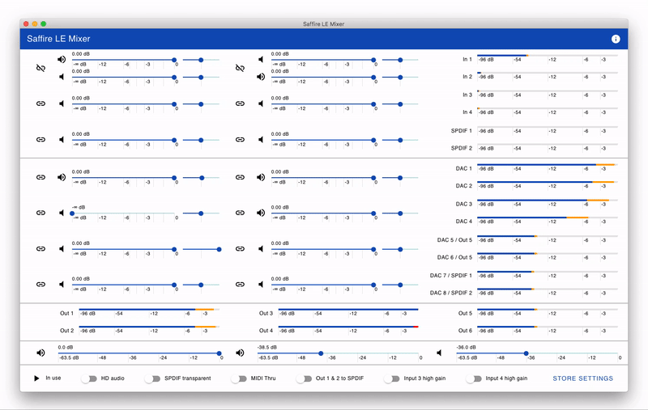

## Saffire LE Mixer

A mixer GUI for [Focusrite Saffire LE](http://web.archive.org/web/20071011003332/http://www.focusrite.com/product/saffire_le/) audio interface for macOS Catalina & Big Sur that still support FireWire audio, but the original SaffireControl LE is no longer usable as it is 32-bit app. It also works on M1-based macs with Rosetta2.

## Download

Go to [Releases](https://github.com/kfigiela/saffire-mixer-ui/releases) page.

## Support

Please report issues via [GitHub Issues](https://github.com/kfigiela/saffire-mixer-ui/issues).

## Web UI

The GUI may be also accessed via network. Navigate to [http://localhost:53625/](http://localhost:53625/) to access it from the web browser. Replace localhost with your computer IP to access remotely.

## Related information

### My blog posts

* [Focusrite Saffire LE on macOS Catalina](https://kfigiela.github.io/2019/10/19/focusrite-saffire-le-macos-catalina/)
* [Focusrite SaffireControl LE responsiveness fix (2015)](https://kfigiela.github.io/2015/10/11/focusrite-saffire-control-le-responsiveness-fix/)

### Online resources

* [FFADO Linux Driver code](https://github.com/adiknoth/ffado/tree/master/libffado/src/bebob/focusrite)

## Acknowledgements

Icon by [Sallee Design](http://www.iconarchive.com/show/music-icons-by-salleedesign/speaker-black-icon.html).
